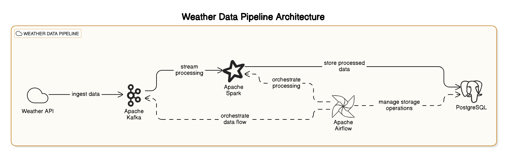

# Weather Data Pipeline

This project sets up a data pipeline to ingest real-time weather data from a public API, process the data using Apache Spark, and store the historical weather patterns in a PostgreSQL database. The pipeline is orchestrated using Apache Airflow and utilizes Apache Kafka for event streaming.

## Architecture

The weather data pipeline consists of the following components:

1. **Data Source**: OpenWeatherMap API (or any other public weather API)
2. **Event Streaming**: Apache Kafka
3. **Data Processing**: Apache Spark
4. **Data Storage**: PostgreSQL
5. **Orchestration**: Apache Airflow

The high-level architecture of the pipeline is as follows:

## Components

1. **Data Source**: The pipeline fetches weather data from the OpenWeatherMap API for a set of predefined cities. The data includes temperature, humidity, pressure, and timestamp information.

2. **Event Streaming**: The weather data is sent to an Apache Kafka topic called `weather_data`. This allows for real-time processing and decouples the data source from the downstream processing.

3. **Data Processing**: A Scala-based Spark Structured Streaming application consumes the data from the Kafka topic, processes it, and stores the processed data in a PostgreSQL database. The processing includes calculating metrics like month-over-month cost and revenue growth.

4. **Data Storage**: The processed weather data is stored in a PostgreSQL database, which can be used for further analysis and reporting.

5. **Orchestration**: Apache Airflow is used to orchestrate the entire pipeline. The Airflow DAG (`weather_dag.py`) defines the tasks and their dependencies, ensuring the smooth execution of the pipeline.

## Getting Started

To set up the weather data pipeline, follow these steps:

1. Clone the repository: `git clone https://github.com/your-username/weather-pipeline.git`
2. Navigate to the project directory: `cd weather-pipeline`
3. Set up the required environment variables in the `.env` file:
   - `OPENWEATHER_API_KEY`: Your API key from OpenWeatherMap
   - `POSTGRES_USER`: Username for the PostgreSQL database
   - `POSTGRES_PASSWORD`: Password for the PostgreSQL database
   - `POSTGRES_DB`: Name of the PostgreSQL database
4. Build and run the Docker containers: `docker-compose up -d`
5. Access the Airflow web UI at `http://localhost:8080` and log in with the admin credentials (username: `admin`, password: `admin`)
6. Verify that the `weather_pipeline` DAG is present and running correctly.

## Monitoring and Troubleshooting

1. Check the logs of the individual containers:
   - Airflow: `docker logs weather-pipeline_airflow_1`
   - Kafka: `docker logs weather-pipeline_kafka_1`
   - Spark: `docker logs weather-pipeline_airflow_1` (the Spark consumer is running inside the Airflow container)
   - PostgreSQL: `docker logs weather-pipeline_postgres_1`

2. Monitor the Kafka topic:
   - Connect to the Kafka container: `docker exec -it weather-pipeline_kafka_1 /bin/sh`
   - List the topics: `kafka-topics.sh --list --bootstrap-server localhost:9092`
   - Consume messages from the `weather_data` topic: `kafka-console-consumer.sh --topic weather_data --from-beginning --bootstrap-server localhost:9092`

3. Inspect the PostgreSQL database:
   - Connect to the PostgreSQL container: `docker exec -it weather-pipeline_postgres_1 psql -U admin -d weather_db`
   - Query the `weather_data` table: `SELECT * FROM weather_data LIMIT 10;`

4. Monitor the Airflow DAG execution:
   - Check the Airflow web UI for the status of the `weather_pipeline` DAG
   - Inspect the task logs for any errors or issues

## Future Enhancements

1. **Additional Data Sources**: Ingest weather data from multiple APIs to increase coverage and redundancy.
2. **Data Quality Checks**: Implement data validation and quality checks to ensure data integrity.
3. **Alerting and Monitoring**: Set up alerts and monitoring for key pipeline metrics, such as Kafka topic sizes, Spark job failures, and PostgreSQL data consistency.
4. **Deployment Automation**: Automate the deployment of the pipeline using tools like Terraform or Ansible.
5. **Scaling and High Availability**: Explore ways to scale the pipeline components and ensure high availability, such as using Kubernetes or a managed Kafka service.
6. **Visualization and Reporting**: Integrate the pipeline with a data visualization tool (e.g., Grafana) to create custom dashboards and reports.

## Contributing

If you'd like to contribute to this project, please follow these steps:

1. Fork the repository
2. Create a new branch for your feature or bug fix
3. Commit your changes and push the branch
4. Submit a pull request